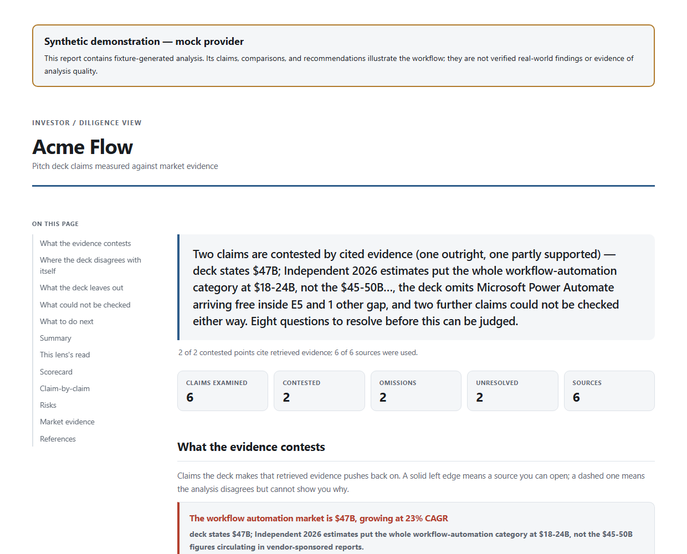

# DeckScope

Turn a document's claims into a traceable report you can check: what the evidence contests, what the document leaves out, what remains unknown, and what to ask next.

DeckScope is an exploratory evidence engine with routes for pitch decks, scoped market reports, grant proposals, and nonprofit filings. It keeps claims, source records, arithmetic, and unanswered questions visible in the output. The first example below follows a pitch deck all the way to a report.

## See the report

[Open the synthetic HTML example](examples/catalogue-demo/report.html) | [Inspect its findings](examples/catalogue-demo/findings.json) | [Read the input deck](deckscope/examples/sample_deck.md)

The supplied **Acme Flow** demo produces six examined claims, two contested claims, two omissions, and two unknowns. Its mock provider supplies fixture-generated analysis, and its report carries a prominent synthetic-demo label. Those counts demonstrate the working report path; they are not real financial findings or evidence of model quality.



## Run the complete offline example

Python 3.9 or newer. From the repository root:

```sh
python -m pip install -e .
python -m deckscope demo --out output --format html md json
```

Follow the [worked claim-to-source trace](docs/READING-THE-DEMO.md) to inspect why C1 is grouped as contested.

Open `output/acme_flow_investor.html`. The same run writes a Markdown report and a full JSON record. It uses the bundled sample, requires no API key, and makes no live research call.

The [provider registry](deckscope/providers/registry.py) ships 11 backends: mock, manual, Anthropic, OpenAI, OpenAI-compatible, OpenRouter, Groq, Gemini, Bedrock, MCP, and CLI. Dependencies and credentials depend on the selected backend.

For a document of your own, start with the [quick start](docs/QUICKSTART.md) and [complete project guide](PROJECT-GUIDE.md). They cover provider selection, research backends, additional document routes, privacy controls, and optional output formats.

**Data leaving your machine:** hosted AI services receive the document text you send for analysis. When web research is enabled, deck-derived search queries go to the configured search service. A local model alone does not make web research local; review the guide's NDA controls before using confidential documents.

## What makes the report inspectable

- [The findings layer](deckscope/findings.py) groups contested claims, omissions, unknowns, and next steps. Python builds its headline from those counts.
- [The source registry](deckscope/sources.py) records sources and audits whether citations resolve to admitted evidence.
- [The orchestrator](deckscope/orchestrator.py) keeps deck reading, market research, and comparison as separate inputs and outputs.
- [The HTML renderer](deckscope/render/html_renderer.py) gives each cited finding a route back to its source and labels mock-provider reports before the findings.

## What this example establishes

The offline pipeline, citation handling, and report presentation can be inspected without credentials. The demo does not establish live research accuracy or superior analysis. Open original sources before using a real report; unanswered questions remain unanswered. Grant and nonprofit routes remain explicitly ungraded in the existing guide.

The [complete project guide](PROJECT-GUIDE.md) preserves the original documentation, including the broader research work, benchmark boundaries, setup paths, and detailed limitations. [Security](SECURITY.md) | [Third-party notices](THIRD_PARTY_NOTICES.md) | [MIT license](LICENSE).
